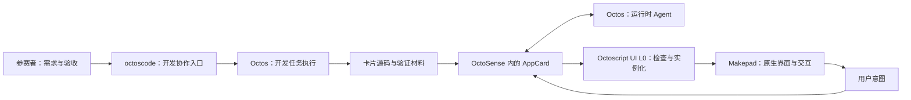

# 从意图到应用：四小时黑客松开课课程

2026-09-25 编写。面向参赛者、产品设计者与开发者，不要求先学 Rust 或脚本语法。课程以 **OctoSense、Octoscript-AppCard、octoscode、Octoscript** 为主角，借助 Makepad 呈现原生交互，由 Octos 提供 Agent 执行能力。

| 课程 | 北京时间 | 课后成果 |
|---|---|---|
| [OctoSense × Makepad：让意图成为应用](lesson-01.md) | 9/26（六）10:00–12:00 | 一页任务说明、一张运行关系图、正常与失败状态的验收标准 |
| [octoscode × Octoscript：和 Agent 一起做应用](lesson-02.md) | 9/26（六）14:00–16:00 | 一次由 Agent 完成、经人核验的卡片迭代，以及复现与演示材料 |

合计 240 分钟，含每堂 10 分钟休息，教学与练习共 220 分钟。沿用官网的两个时段；9/27 的 OctoLoop、Rinx / hagency 课程和后续赛程保持原安排。本包集中准备这两堂课。

## 课程主线

> 我明天在深圳参加活动。帮我查看当地天气，让我切换温度单位；如果数据取不到，要告诉我当前不能判断，不能编一个答案。

贯穿案例叫“参会天气卡”。第一版聚焦一个城市、真实数据、一个有效操作和一个失败状态。出行建议、空气质量、日程和消息分享是后续扩展，必须先核实对应能力与数据。课堂不把天气卡说成已完成导航、预订或自动发消息的旅行助手。

“让意图成为应用”的价值在于：用户不需要重复找入口、搬数据和解释上下文；Agent 负责理解任务并组织应用，界面让用户看见当前状态、采取下一步操作、核对结果。能展示漂亮卡片只是起点，任务是否完成才是比赛关注点。

## 六个角色，两种协作

| 角色 | 面向学员的一句话 | 本课观察什么 |
|---|---|---|
| OctoSense | 用户打开、操作和切换应用的宿主 | 卡片在同一应用环境中出现，状态与结果可以检查 |
| Octoscript-AppCard | 把意图路由给应用 Agent，并管理生成卡片的应用层 | 请求、生成、校验、数据绑定、交互更新 |
| Makepad | 把界面变成原生控件和真实交互 | 点击是否改变状态，窗口变化后能否继续用 |
| Octos | Agent 的运行内核 | 模型、工具、会话与执行进展；任务失败如何反映到界面 |
| octoscode | 开发者与编码 Agent 协作的终端入口 | 交代任务、看修改、运行验证、退回修正 |
| Octoscript | 受约束的应用表达与能力机制；本课使用其 UI L0 卡片路径 | 结构、数据来源、状态与事件如何被宿主接住 |

开发时的 Agent 帮参赛者修改作品；运行时的 Agent 帮用户完成任务。图中的两个 Octos 是职责示意，课堂使用隔离的开发与应用会话，不宣称它们自动共享上下文。

## “把 Octos 整合进 OctoSense”怎么讲

最新源码已存在 **OctoSense → AppCard AppShell → Octos** 的集成路径。这次课程应讲如何使用、观察和验证这条路径，以及哪些缺口可以成为参赛贡献。无须把已有接入重新描述成待开发功能。

本轮完成了源码更新/隔离检出、调用链核对和课程设计；**没有编译并实跑这组最新 GUI 版本**。课程环境须通过 [讲师演示与准备手册](demo-runbook.md) 的准入检查后，才能标为“现场实机演示”。锁定版本与功能边界见 [源码依据与整合路线](integration-and-sources.md)。

## 上课材料

- 讲师：[第一堂讲稿](lesson-01.md)、[第二堂讲稿](lesson-02.md)，各含分钟安排、讲述要点、演示与互动。
- 助教：[演示与准备手册](demo-runbook.md)，含启动依据、两条 AppCard 流程、失败处理和截图清单。
- 学员：[练习包](workbook.md)，含可复制的 Agent 指令、任务模板、反馈模板和验收记录。
- 平台负责人：[整合路线与固定源码引用](integration-and-sources.md)，区分已有能力、待验证事项与后续工程任务。

无开发环境的学员可以结对担任产品与验收角色，完成同一任务说明和观察记录；它是机制练习，不计作个人已完成可运行应用。安装、模型账号配置和大规模编译安排在课前，不占用四小时。

## 课程结束的验收

学员能够说明四个主项目的分工；能够交给 Agent 一个有边界、可判断完成的任务；能够区分源码校验、应用运行和用户任务完成；能够展示一项实际改动及正常、失败两类证据。未跑通的作品如实记录阻塞，不用截图或 Agent 的完成声明代替运行结果。

课后将这套方法迁移到自己的参赛场景。即时消息方向继续以 Rinx 为宿主；hagency 是软件协作方向的可选能力。初赛与复赛材料要求以 [完整课程与赛程](../../curriculum.md) 为准，本课验收不新增比赛评分权重或晋级条件。
