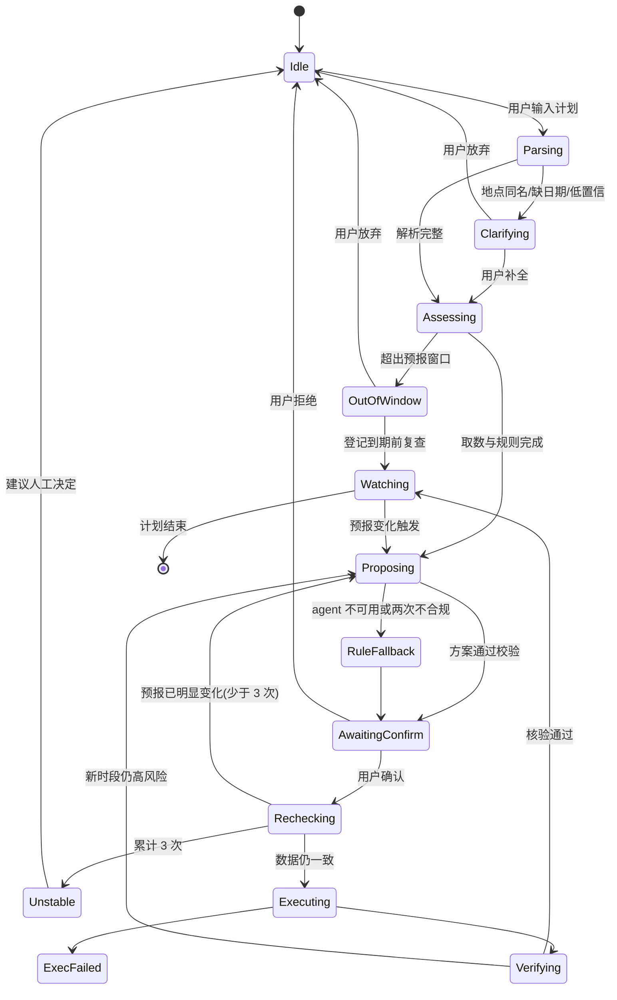

# 行程守护设计蓝图

演示项目 `octo-weather` 的核心功能设计(蓝图 v0.3,已过异厂牌对抗评审)。`octo-weather` 是以 makepad `apps/weather` 为起点的独立原生天气 app,对应官方天气场景:「结合天气、空气质量与活动计划,提出**有来源、可确认**的出行建议」。

## 一句话

用户说出一个带地点和时间的计划,octos agent 理解它、结合有来源的真实预报判断风险并给出方案;用户确认后,app 执行方案并自己核验结果,之后持续跟进预报变化。

## 最重要的原则:模型写理解和方案,不写事实

| 环节 | 谁负责 |
|---|---|
| 解析自然语言计划 | octos agent |
| 地点坐标、预报数据 | 确定性代码(Open-Meteo) |
| 风险判定 | 确定性规则引擎 |
| 方案与解释 | octos agent,只能引用 app 提供的事实 |
| 执行 | app 内白名单动作执行器,用户确认后才执行 |
| 核验 | 确定性代码:读回结果、重取新时段预报 |

## 对照评审要求

| 最佳 Agentic 评审要求 | 本设计怎么满足 |
|---|---|
| 任务完成 | 自然语言计划 → agent 解析与方案 → 用户确认 → 执行 → 确定性核验 |
| 可靠运行 | 显式状态机;9 类失败状态各有界面与恢复路径;agent 不可用时降级为规则建议 |
| 人机协作 | 每个数字标注来源与数据时间;不确认不执行;解析结果和方案都能手动修改 |

## 演示脚本

1. 输入「周六上午 9 点和朋友去深圳湾骑车,大概两小时」。
2. **解析卡**(agent):地点、日期、时段、活动,每项可修改。
3. **风险卡**(规则):该时段降水概率、降水量、体感温度、风速、UV,逐项标注来源与数据时间。
4. **方案卡**(agent):改期 / 改室内 / 带雨具,解释只能引用第 3 步的数据。
5. 用户确认。
6. **执行**:行程簿改期,加入复查提醒。
7. **核验**:读回确认;重取新时段预报并重算风险。
8. **跟进**:预报变化时主动提示并重新给方案。
9. **失败演示**:同名地点候选;断开 octos 时显示「agent 暂不可用,以下是规则建议」。
10. **重复测试**:同一方案再确认一次,显示「已执行,未重复」;可点开审计条目。

## 状态机

竞态规则:每次 agent 请求带单调递增的 `request_id`,迟到的旧回复直接丢弃;点确认后按钮立即禁用。

## Agent 协议与校验

- 每个守护实例一个 octos 会话,角色说明每轮内联进消息;agent 不拿工具,只输出严格 JSON(解析结果、方案)。
- app 侧校验:JSON 结构;动作在白名单内且参数合法;引用的事实 id 存在;**防编造**——先归一化(中文数字互转、「9 点」等同 09:00),豁免日期、时刻、时长、方案字母,温度、概率等数据类数值必须与事实比对,允许 ±1 舍入;数值必须带指标词或被引用覆盖。
- 不合规回发同一会话修一次,仍不合规走规则兜底。

## 风险规则与执行动作

| 指标 | 高风险 | 中风险 |
|---|---|---|
| 降水概率 | ≥ 60% | 30–59% |
| 小时降水量 | ≥ 2 mm | 0.5–1.9 mm |
| 体感温度 | ≥ 35 ℃ 或 ≤ 0 ℃ | 32–34 ℃ |
| 风速(户外运动) | ≥ 38 km/h | 28–37 km/h |
| UV 指数 | — | ≥ 8 |

白名单动作(初赛版):`reschedule`(新时间必须晚于现在且在预报窗口内)、`mark_indoor`、`add_checklist`、`set_recheck`。全部幂等,执行前写审计日志。

## 异厂牌对抗评审

总判「修改后开工」(BLOCKER 0 · MAJOR 4 · MINOR 8),全部意见已并入:

| 问题 | 改法 |
|---|---|
| 外部 git 依赖解析链脆弱 | 第一片第一小时先验证,失败即改本机路径依赖(实际一次通过) |
| 防编造检查字面实现会误伤也会漏检 | 归一化 + 豁免清单 + ±1 容差,误伤场景写成单测 |
| 状态机缺出口、有竞态 | 补退出边、request_id 丢弃旧回复、确认门闩、循环上限 3 |
| 排期零缓冲 | 界面集成拆为「不接 agent 干跑」与「接入 agent」两段 |

## 切片与进度(截至 9/26 晚)

| 片 | 内容 | 状态 |
|---|---|---|
| G1 | 依赖验证、蓝图落库、行程数据模型、状态机纯逻辑 | 已采认 |
| G2 | 逐小时取数、风险规则引擎、规则兜底、防编造检查 | 已采认 |
| G3 | 连接 octos、JSON 校验与一次修复 | 已采认:真实冒烟 8.4 秒通过 |
| G4a | 不接 agent 的界面干跑 | 进行中 |
| G4b | 接入 agent 通路 | 待办 |
| G5 | 失败状态、跟进复查、重复测试 | 待办 |

每片都由外环在隔离 worktree 复验、目视截图后才放行下一片;过程见 [OctoLoop 实战过程记录](process.md)。
