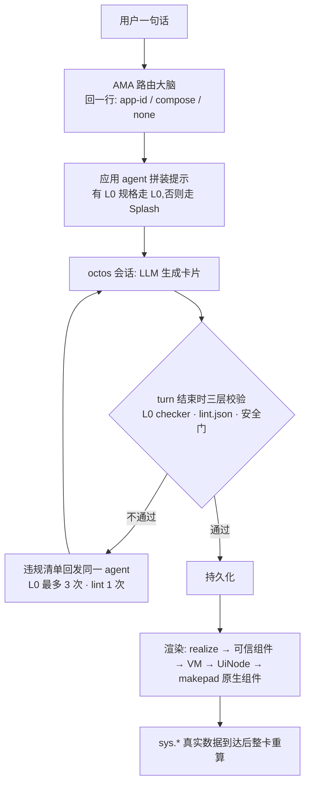

# Octoscript 与卡片生成流水线

Octoscript 是什么,「一句话生成一张可交互原生卡片」的流水线怎么运作,两者是什么关系。

## 三句话

- **Octoscript**:一门 capability-first 的脚本语言,让 LLM 写、由宿主审查和授权、由 Rust 应用执行,脚本默认拿不到任何进程权限(`OctoScript/docs/positioning.md`)。
- **生成流水线**:OctoSense-AppCard 里「一句话 → 卡片」的链路。路由大脑把意图分给某个应用 agent,agent 按内置语料生成卡片,卡片经校验和有限次自动修复,再绑定真实数据渲染成原生界面。
- **两者关系**:Octoscript 是流水线的目标语言和安全底座。流水线让模型写的新主线是 Octoscript 的 UI Profile L0 卡,目前已有 11 个应用迁移;没有 L0 规格的应用退回 Splash 脚本。

## 最关键的一点:模型写的东西会不会直接进 VM

- **Splash 卡:会。** 模型写的是一段 makepad Splash 脚本,直接在隔离 VM 里求值,所以 AppCard 只能靠子串扫描拦截 `net.*` 网络调用,文档自己承认「不是硬边界」(`OctoSense-AppCard/docs/ARCHITECTURE.md`)。
- **L0 卡:不会。** L0 没有表达式,写不出任何调用;`realize` 只是遍历树并填入数据(`OctoScript/crates/octoscript-ui-l0/src/lib.rs` 的 `realize`),产物是对**预先写好、可信的组件**的调用,进 VM 的是这些可信组件。

## 一门语言,两个兄弟 profile

| | 工作流 profile | UI Profile L0 | UI Profile L1 |
|---|---|---|---|
| 用来写什么 | 生成式工作流、工具编排、有界数据变换 | 模型生成的界面卡片 | L0 加一种表达式:二元算术 |
| 入口 | `check_syntax` / 能力运行时;拒绝 UI 构造 | `check_ui_l0` / `realize` | 同 L0,卡片须声明 `# level: L1` |
| 副作用 | 默认全拒,只有宿主注册的工具、HTTP 端点、存储能力 | 够不到任何能力 | 同 L0 |
| 求值器 | 有界 VM | 没有 | 有界求值器 |
| 防编造规则 | — | 数值必须来自声明的数据源 | 表达式必须至少读一个数据源或状态 |

两个 profile 分开,是因为副作用面完全相反:工作流必须有受控的副作用通道,卡片必须证明不存在副作用通道。

## 一张真实的 L0 卡

Rinx 原生文章编辑器的整张卡(`Rinx/crates/article-core/resources/app.card`),宿主审定后编译进程序:

```text
state title { shape: text, initial: "" }
state markdown { shape: text, initial: "" }
event title_changed { title: set($value) }
event markdown_changed { markdown: set($value) }
copy title_hint { class: vocabulary, en: "Article title", zh: "文章标题" }
copy body_hint { class: vocabulary, en: "Write in Markdown…", zh: "用 Markdown 写下你的文章…" }
view root Surface {
  Col {
    Field(text: title, placeholder: copy.title_hint, on_change: title_changed)
    Field(text: markdown, placeholder: copy.body_hint, on_change: markdown_changed)
  }
}
```

L0 只有六类声明:`source`、`state`、`event`、`copy`、`component`、`view`。卡片只命名角色,不写外观;没有算术、字符串拼接、if、let 或函数。

## 生成流水线



- **octos 只在一处介入**:每个路由大脑和应用 agent 都是 octos 的一个会话;校验、实例化、渲染都不在 octos 里。
- **三层校验**:L0 checker(含等级门槛)、每个应用的 `lint.json` 子串规则(例如天气卡 `sys.weather(` 至少出现 22 次)、禁止低层 `net.*` 的安全门。
- **模型写绑定,不写事实**:数字来自 `sys.*` 数据助手,不是模型写出来的。

## 渲染链

```text
L0 卡 + 数据 ──realize()──▶ 语义树(无求值器)
语义树 ──kit 展开──▶ 调用可信组件的 Octoscript DSL
DSL ──octoscript_render::build()──▶ UiNode(与后端无关)
UiNode ──to_makepad_ui()──▶ makepad 组件方言
方言 ──Splash──▶ 原生 widget 树
```

makepad 在这套架构里是「一个渲染后端」,ArkUI(OpenHarmony)是兄弟后端。`runtime.json` 把 makepad `1d3d383` 与 Octoscript `68f6a9d` 钉在一起。

## 同一门 L0,两种信任方式

| | Rinx:宿主审定型 | AppCard:模型生成型 |
|---|---|---|
| 卡的来源 | 人写、评审,编译进宿主 | 模型按意图现场生成 |
| 能力 | 极小:两个输入框,实例化上限 16 个节点 | 开放:11 个 L0 应用加 Splash 兜底 |
| 安全靠什么 | 准入与授权:按次签发、绑定账号与实例、最长一小时 | 语言约束加生成后校验 |

## 各仓库分工

| 仓库 | 负责什么 |
|---|---|
| OctoScript | 语言契约、工作流运行时、UI L0/L1 的校验器、实例化器与审批 |
| OctoScript-Makepad | DSL 求值成 UiNode、翻译成 makepad 方言、组件库与主题、版本锁 |
| OctoSense-AppCard | 生成流水线:路由、应用 agent、语料、校验修复、持久化、数据绑定 |
| OctoScript-App-Design-Flow | 设计方法、从草图 / 图片生成原生卡的 `lab/` 流水线;AppCard 于 9/25 从这里拆出 |
| makepad | Splash 宿主、原生 widget、`sys.*` 取数 |
| Rinx | 第二个消费方:宿主审定的 L0 文章编辑器 |
| octos | 为每个 agent 提供 LLM 会话;把语料注入记忆 |

## 对参赛者的含义

想让 agent 生成应用,**该写**:规格与语料(`a2app-l0/apps/<id>/app.md` 加一张范例卡)、可执行的检查规则、组件而非范例、声明数据源。**不该写**:让模型读文件或写死数字、在 L0 卡里写逻辑、在卡片里直接发网络请求、渲染后端细节。
