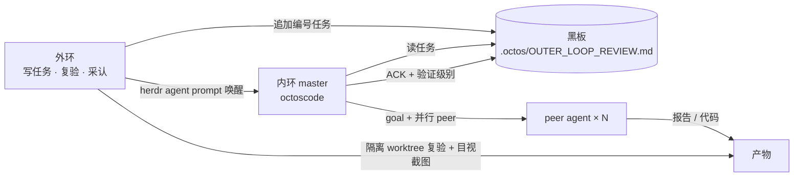

# OctoLoop 实战过程记录

9/26 的演示用 OctoLoop 双环完成了两件事:**调研比赛与技术栈**,以及**从零做一个参赛应用**。本页按时间记录做了什么、每一步怎么验收,以及可以直接借鉴的教训。

## 分工:外环与内环

| 角色 | 由谁担任 | 职责 |
|---|---|---|
| 外环 | Claude Code(强模型) | 写任务、派单、在隔离环境独立复验、判定是否采认;不写业务代码 |
| 内环 | octoscode + `octos serve`(glm-5.3) | 读黑板、执行最小编号的未完成任务、只提交不推送、按固定格式回报 |
| 第二外环 | 另一家模型(glm 车道) | 对设计蓝图做异厂牌对抗评审 |
| 操作者 | 人 | 定方向、做授权决定(如是否允许免沙箱运行) |

协作全部走文件:每个工作目录一块黑板 `.octos/OUTER_LOOP_REVIEW.md`。外环追加带编号的任务,内环完成后在任务下写一行 `ACK(done|wontdo|blocked): …` 并声明验证级别(verified / partially-verified / unverified)。每个内环都开在可见的 herdr 标签页里,外环用 `herdr agent prompt` 唤醒、用 `herdr agent read` 观察。

## 第一部分:三路并行调研

同一时间开了三个内环,各有独立的工作目录和黑板,互不抢任务。每路内环用 `goal` 建目标,再用 `peer` 派出多个并行 agent。

| 调研路 | 并行 peer | 产物 | 结论见 |
|---|---|---|---|
| 比赛与技术栈情报 | 6 个:规则、OctoSense、Octoscript、Makepad、octoscode、Rinx | 6 份分域报告 + 汇总 | [相关项目与仓库](projects.md) |
| OctoSense 应用机制与 octos 集成 | 2 个 | 2 份报告 + 汇总 | [OctoSense 与 octos 集成](octosense-octos.md) |
| Octoscript 与卡片生成流水线 | 4 个 | 4 份报告 + 汇总 | [Octoscript 与卡片生成流水线](octoscript-pipeline.md) |

**外环怎么验收调研报告**:

- 每份报告的结论都要带 `文件:行号`。前两路外环抽样 96 处,逐一核对文件存在、行号在范围内;第三路逐条回源核对了 11 项关键事实。
- 关键结论回到源码逐字核对,例如 Rinx 文档里「Octos AppService and BotFather remain separate integrations」这句原话。
- 发现错误就在黑板上记档并在对外材料里更正。当天的两处更正:内环汇总把 Octoscript 的步骤误标成 octos 的介入点(把 octos 和 Octoscript 搞混了);把迁移到 L0 的应用数写成 12 个,核对源码实为 11 个。

## 第二部分:本地跑起来

- **课程书**:`mdbook serve`。
- **OctoSense**:`cargo run` 编译运行桌面宿主。
- **AppCard 天气卡**:启动 `octos serve`(HTTP + 令牌),写 `~/.config/octos-app/server.json`,用 `--features app-appcard -- --module appcard` 运行 OctoSense,在 AppCard 里输入「深圳天气」得到一张实时数据卡片。AppCard 默认不出现在启动器里,需要用一份带 AppCard 行的临时应用目录 `--apps` 启动。
- **远程驱动界面**:所有 Makepad 应用都支持 `--remote` 或 `MAKEPAD_REMOTE=true`,提供截图、控件查询、点击、按键和中文文本输入接口(见 makepad 的 `docs/agents/app-remote.md`)。外环用它亲自操作 app 并看截图。

## 第三部分:做一个参赛应用

选题是官方天气场景。先确认 makepad 自带一个完整的原生天气 app(`apps/weather`,Open-Meteo 数据、失败状态、AI 总线工具都有),以它为起点做独立项目 `octo-weather`,然后逐片交给内环。

| 任务 | 内容 | 外环复验时发现的问题 |
|---|---|---|
| #2、#5 | 独立化:钉住依赖版本、署名、构建、测试 | 一个上游测试在测试执行中崩溃(不是 ACK 说的「退出时」),上游同样崩溃,带理由忽略 |
| #3 | 中文界面、城市搜索、失败状态(搜不到 / 同名多个 / 网络失败) | 逻辑通过,但截图里文字被叠压看不清 |
| #6、#7 | 修城市面板 | 根因是玻璃模糊卡片单独合成,永远盖在普通面板上;外环定位后给出一行修法 |
| #9 | 面板次级文字对比度 | 通过 |
| #4、#10 | 预报日期「今天 / 明天 / 9/28 周一」 | 首版变成 ISO 日期、星期丢失、与图标叠压 |
| G1 | 依赖验证、蓝图落库、数据模型、状态机 | 通过 |
| G2 | 逐小时取数、风险规则、规则兜底、防编造检查 | 通过,遗留两处设计缺口并入后续切片 |
| G3 | 连接 octos | mock 测试全绿,但外环亲跑真实冒烟失败:当前服务端用新版事件格式宣告回合结束,客户端只认旧格式;照 AppCard 的做法修复后 8.4 秒通过 |

功能设计先写成蓝图,再交第二外环做异厂牌对抗评审,评审意见全部并入后才开工,详见 [行程守护设计蓝图](octo-weather-guardian.md)。

## 可以直接借鉴的教训

1. **截图要自己看,不能只信回报。** 当天三次出现 ACK 对截图的描述比截图本身好;控件树里能读到文字,不等于用户看得见。
2. **mock 通过不代表真实可用。** G3 的 5 个 mock 契约测试全部通过,真实服务端却失败,因为 mock 发的是旧版事件。关键链路一定要跑一次真实冒烟。
3. **诚实的「部分验证」比虚高的「已验证」更有用。** 内环主动声明「冒烟未跑通,不计入 verified」,外环就能直接定位问题。
4. **定位工作外环做,施工交给内环。** 玻璃层级、v2 事件这类问题,外环读源码定位根因、写出行号级的修法,内环照图施工一次完成。
5. **设计先过对抗评审再开工。** 异厂牌评审抓出了防编造检查会误伤合法方案、状态机缺出口、排期零缓冲等问题,都在写代码之前改掉了。
6. **依赖和配置要趁早验证。** 用外部仓库的 crate、临时新建的模型配置、需要重启才能加载的服务,都在第一小时验证,别等到集成时才发现。
7. **令牌只放环境变量和配置文件,命令输出里不打印。** 当天调试时令牌误入一次输出,立即轮换。
